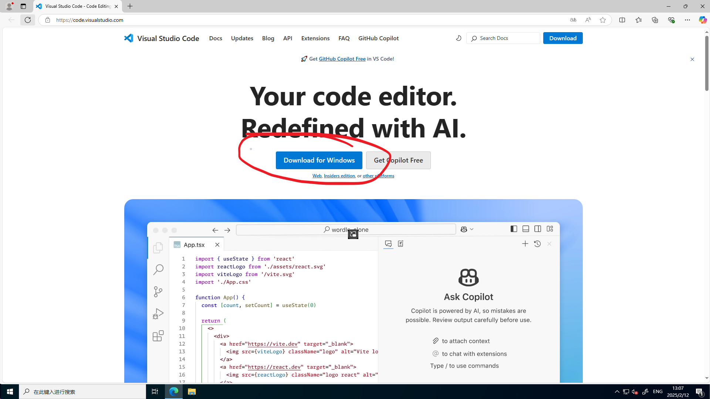

# 安装并配置VSCode
首先打开VSCode的官网[https://code.visualstudio.com/](https://code.visualstudio.com/)。  
打开之后是这个样子的：

点击“Download for Windows”。  
点击之后浏览器会跳转到如下图的页面，同时开始下载VSCode的安装包。如果没开始下载，点一下下图红色圈圈的链接。

打开下载的.exe文件，勾选“我同意此协议”，随后点击”下一步“。  
选择一个你喜欢的路径安装，随后点击“下一步”。  
再点一次“下一步”。

看到此页面，确保“添加到PATH”为勾选状态，随后点击“下一步”。  
点击”安装“，等待安装。  
安装完毕，启动VSCode。

启动VSCode之后如上图，点开红色圈圈圈住的部分。

点击图示的搜索框，搜索Chinese，安装第一个（Chinese Simplified，点Install）

点击图示的按钮，更换语言并重启VSCode。