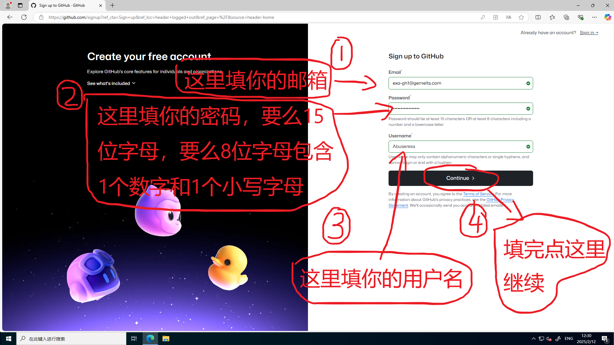
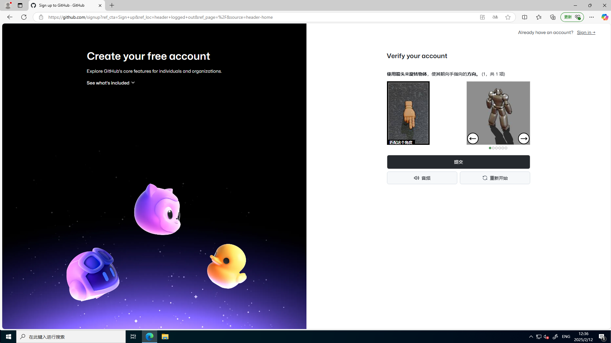
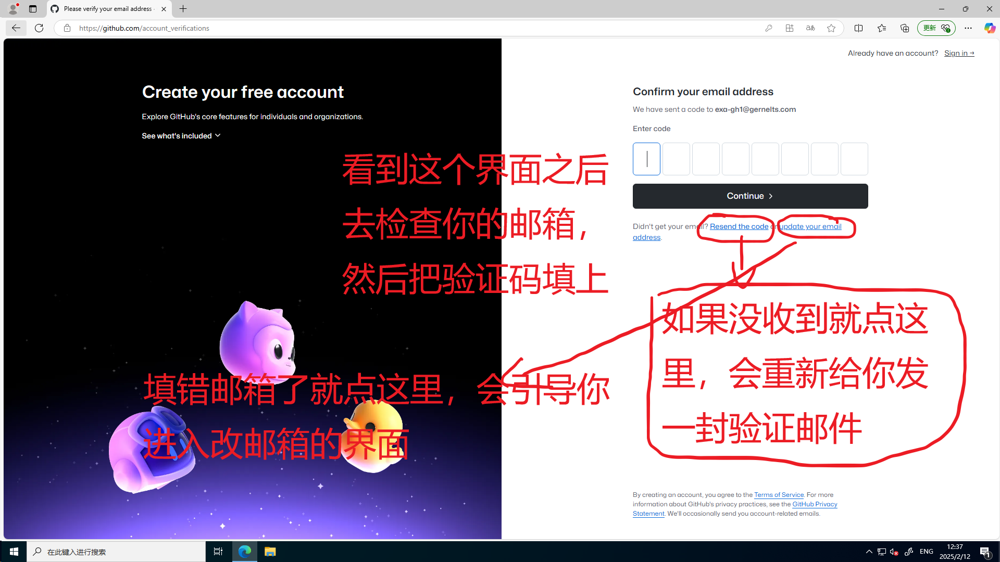
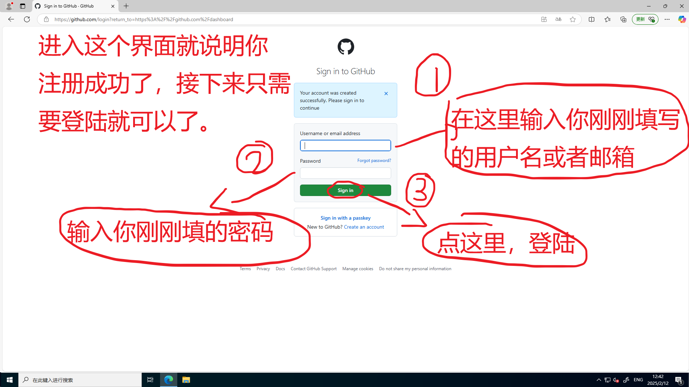
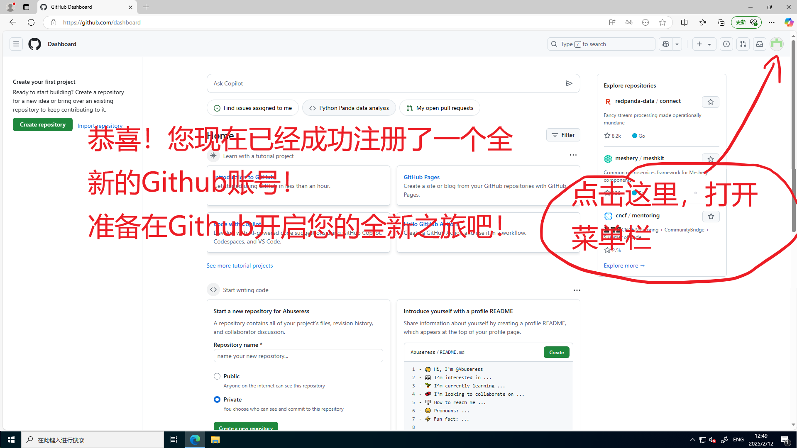
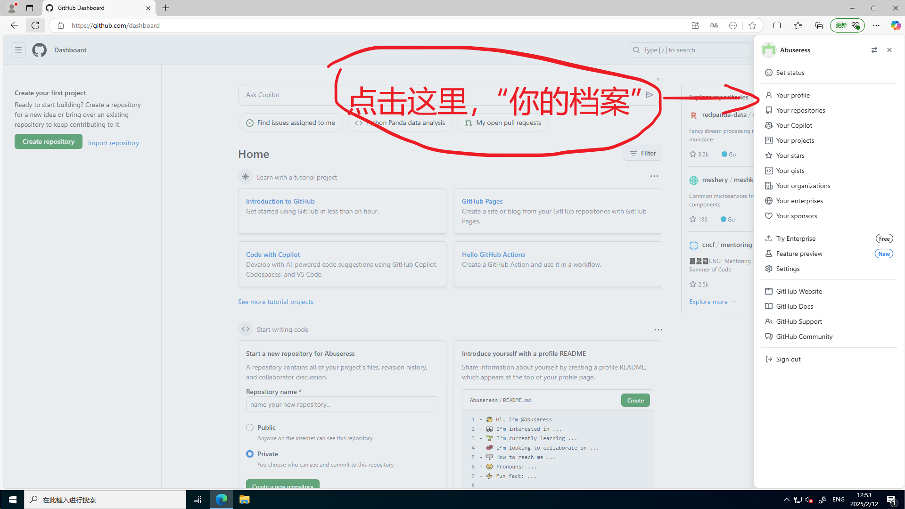
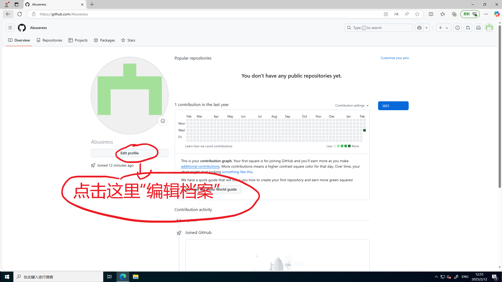
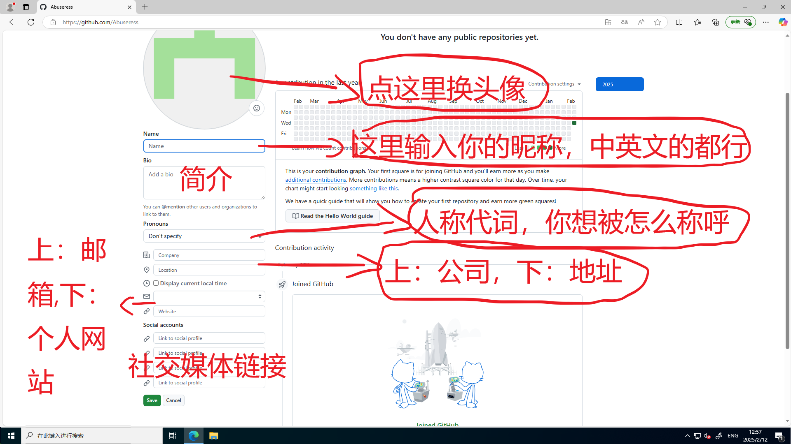

# 注册Github账号
**如果您已经有Github账号了，可以不用看这篇教程，直接登陆即可！**  

首先访问Github的官网[https://github.com](https://github.com)，打开之后是这样的：  

点击“Sign up”开始注册流程。

如图填写完信息之后进行下一步。

简单过一下验证码进行下一步。

如图完成操作。

最后如图完成登陆操作。  
剩下的步骤是如何修改昵称，头像等。您可以自己摸索，也可以跟着教程走。关于如何使用Github，我们会在其他教程详细说明。

如图进行操作。

如图进行操作。

如图进行操作。

如图，把你喜欢的地方填上就行了。