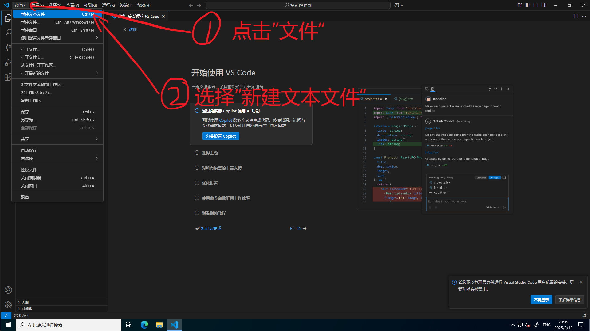
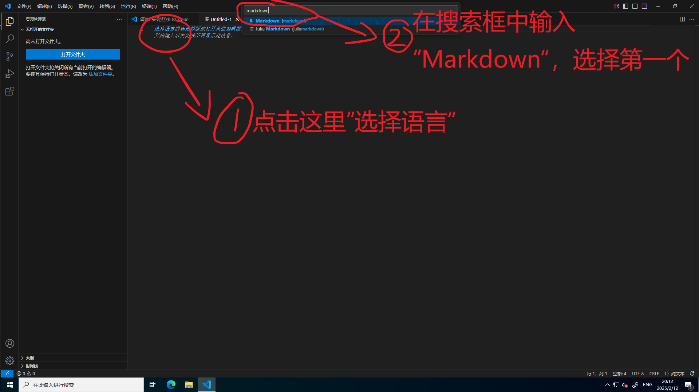
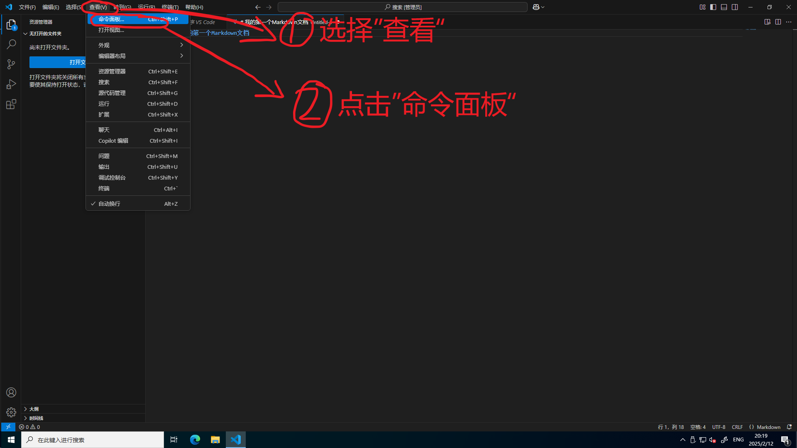
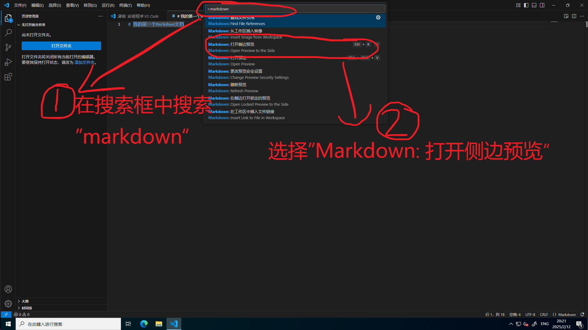
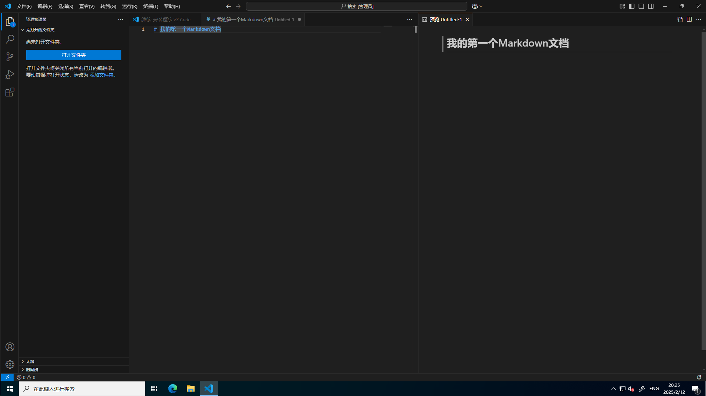

# 白痴都能学会的Markdown教程
### 前言
Markdown真的超级简单！耐心看下去，这篇教程一定会对你有好处的！  
### VSCode显示Markdown侧边预览
首先打开我们之前下载好的工具VSCode。如果你按照教程正确配置好了，那应该是没问题了。

按照如上图步骤操作。

继续，如图上步骤操作。现在你应该得到了一个Markdown文档，可以开始正式编写了。  
在文档第一行中输入以下内容：
> `# 我的第一个Markdown文档`  

那么，该如何查看输出的结果呢？别着急，跟着教程走。

跟着图上的步骤走，然后：

这个时候，你就会惊奇地发现，你可以在本地预览Markdown格式了（如下图）！可喜可贺！

### 标题
在Markdown中，`#+空格+一行文字`表示标题。一个\#是最大的，我们称之为一级标题。相应地，\#\#是二级标题，如此类推，一直到六个\#，一共有六级标题，他们的层级关系逐级递减，字号越来越小。  
在格内茨百科的编纂当中，我们一般只需要用到一级标题\(\#，用于页面最上方，作为页面主标题\)和三级标题\(\#\#\#，作为页面下属子标题\)  
### 示例代码：
# 这是一个一级标题。
> `# 这是一个一级标题。`
### 这是一个三级标题。
> `### 这是一个三级标题。`  

**注意：井号和标题文字之间一定要加空格！**  
### 换行
在Markdown中，换行不再只是直接按Enter了事。你需要在每行的末尾加上两个空格，然后再按Enter。  
欸？或许你已经发现了。无论你按再多的空格和Enter，两个有文字之间的行最多只会空一行。这个时候，就轮到我们的html标签上场了。Markdown和html可以互相转换，html也可以嵌入到Markdown之中。只需要用上html中的换行标签` `，在按下Enter即可了事。一个Enter最多能隔开一行，一个` `标签也能隔开一行。所以，如果你想隔开5行的话，可以加上4行` `标签。
> 这两行文字之间
>
>  
>  
>  
>  
>
> 隔了足足有五行。  

源码如下：
>` 这两行文字之间`
>
>`  `  
>`  `  
>`  `  
>`  `  
>
>` 隔了足足有五行。`

为了保持工整，我们一般会在` `标签的上下都空上一行。这一般不会影响最终的显示结果。
### 强调，斜体，删除线
在markdown中，`**一段文本**`可以给文本加粗。  
**示范文本**。  
而`*一段文本*`可以让一段文本斜体显示。  
*示范文本*。  
那你问删除线怎么办？不好意思，markdown没这个功能。<del>我们跳过不讲。</del>  
咳咳，这个时候就轮到我们的老朋友登场了，html标签。`<del>一段文本</del>`可以让一段文本被划掉。
<del>示范文本</del>
### 有序列表和无序列表
无序列表用`- 第一项：`来表示（记得开一行新的。）换行后的内容会缩进到列表之后，所以还要空一行。
- 示范第一项：  
示范内容。  

这就不会被缩到示范项后面。因为多空了一行。

源代码：  
`- 示范第一项：  `  
`示范内容。  `  
` `  
`这就不会被缩到示范项后面。因为多空了一行。`  
有序列表也是一样的，只不过把`- `换成了阿拉伯数字。  
1. 示范项目

源代码：  
`1. 示范项目`

### 引用链接
Markdown的引用链接如下格式：
> `[显示文本](指向链接)`  

比如，我们要创建一个显示”看看我“，指向Github官网的链接，就要这样写：
> `[看看我](https://github.com)`  

显示效果如下：  
[看看我](https://github.com)  

不仅如此，引用链接还可以跳转到其他文档或文件。比如我们要创建一个显示”点我“，指向创作者指南的链接，可以这样写：  
> `[点我](../index.md)`  

或者
> `[点我](/GerneltsWiki/语言Languages/简体中文/创作者手册/index.md)`  

二者的效果都是一样的。前者使用了相对路径，后者使用了绝对路径。在编写格内茨百科的过程中，我们强烈推荐你使用绝对路径。\(\./表示当前目录下，\.\./表示上一个目录下。以此类推，\.\./\.\./表示上上个目录下。\)如果你没弄错的话，VSCode会自动弹出当且路径下的文件。  
显示效果：  
[点我](../index.md)  
[点我](/GerneltsWiki/语言Languages/简体中文/创作者手册/index.md)  
### 插入图片
插入图片与引用链接没什么不同。只是在前面多加了一个!。
> ``  
> ``  

效果如图：

### 引用
欸？看了那么长时间的教程，这篇教程的引用部分是怎么做的呢？别急，现在就教你。  
只需要新开一行，然后在前面加一个`> `（注意带一个空格）就可以了。快去试试。  
哦对了，换行的时候如果还想继续引用记得在新行继续加`> `。
> 示范文字。  

引用当中还可以包含其他格式，还可以嵌套引用，比如说：
> ### 这是一个三级标题引用
> - 这是一个列表  
>
> 我在**强调**某件事。
>> 这是一个嵌套引用。

源代码：  
`> ### 这是一个三级标题引用`  
`> - 这是一个列表  `  
`>`  
`> 我在**强调**某件事。`  
`>> 这是一个嵌套引用。`
### 代码块与格式消除
咳咳，想必聪明的同学已经发现一个问题了。如果我想使用类似\#，\*，\.，\(\)，\[\]这些东西在文章里面该怎么办呢？  
其实很简单，只需要在前面加个`\`就行了。
示例：
> \#，\*，\.，\(\)，\[\]  

源码：
> `\#，\*，\.，\(\)，\[\]`  

欸？那么又会有聪明的小伙伴会问了，我想展示源代码，而不是被解析后的结果，那怎么办？很简单，只需要拿` `` `把你的源代码括住就行了。  
这个我就不提供示例了<del>这B就是懒</del>，自己去试试吧。
### 制表
这玩意我暂时还没有用到，而且要用html标签，有点麻烦。咕咕咕。  
 
本教程到此完结，啪啪啪，完结撒花~  
声明：本教程不是专业的Markdown教程，旨在为Markdown萌新提供基本的Markdown知识。如有错漏，欢迎勘误！  
**更多Markdown知识，请上搜索引擎搜索！**