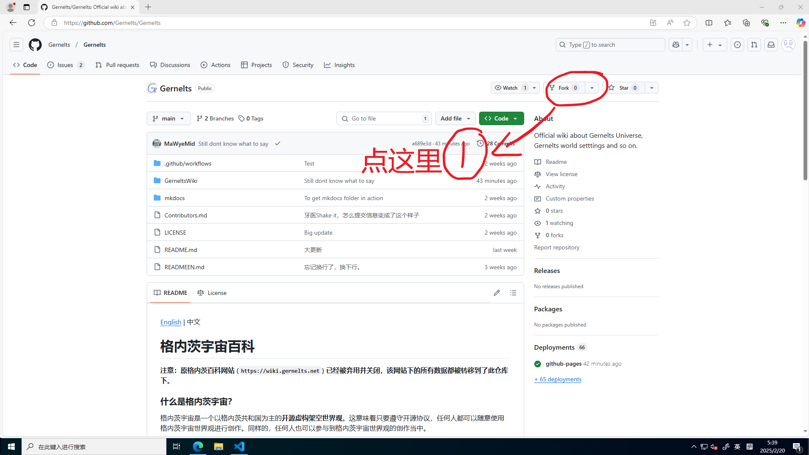
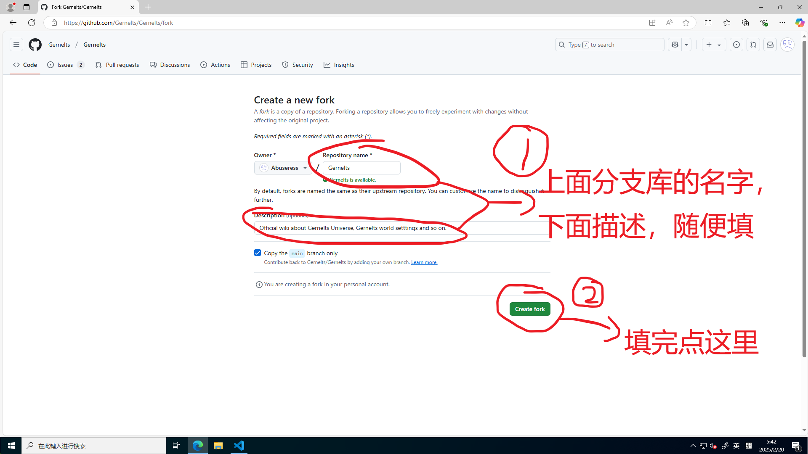
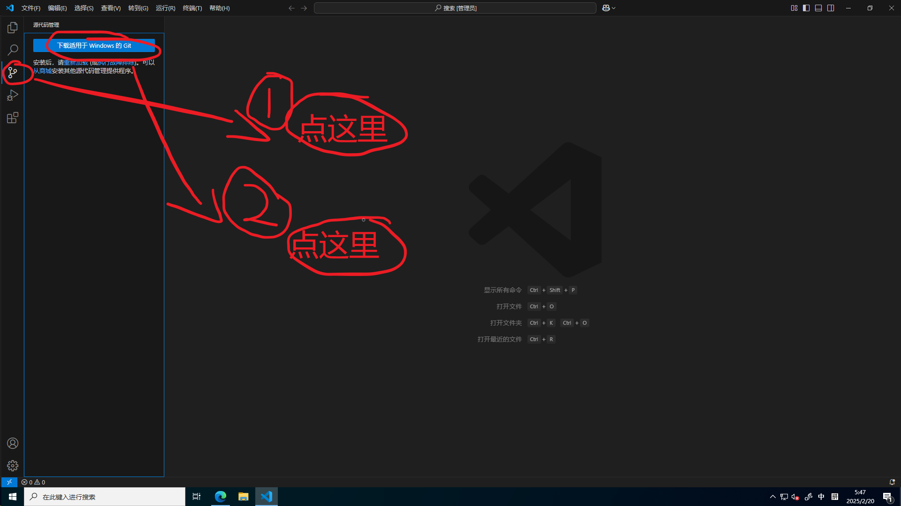
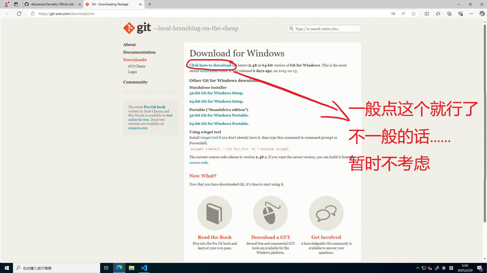
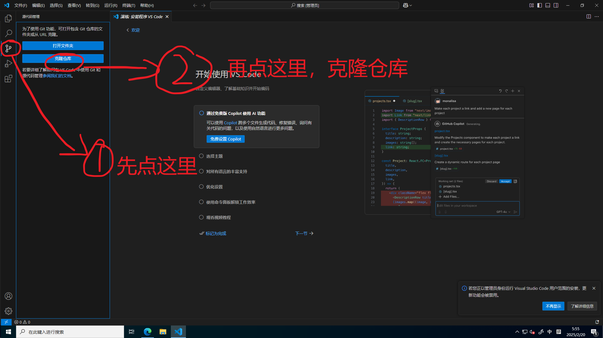
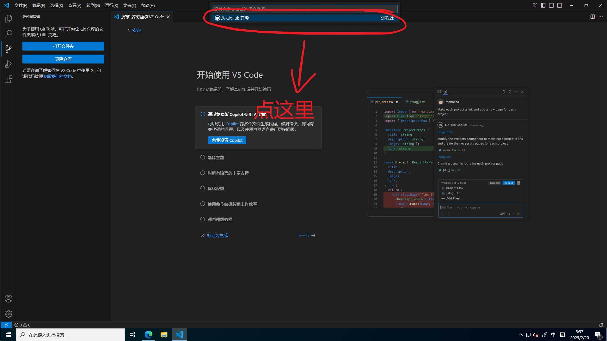
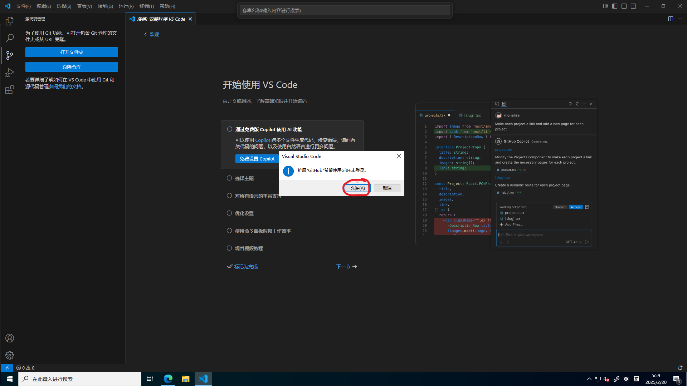
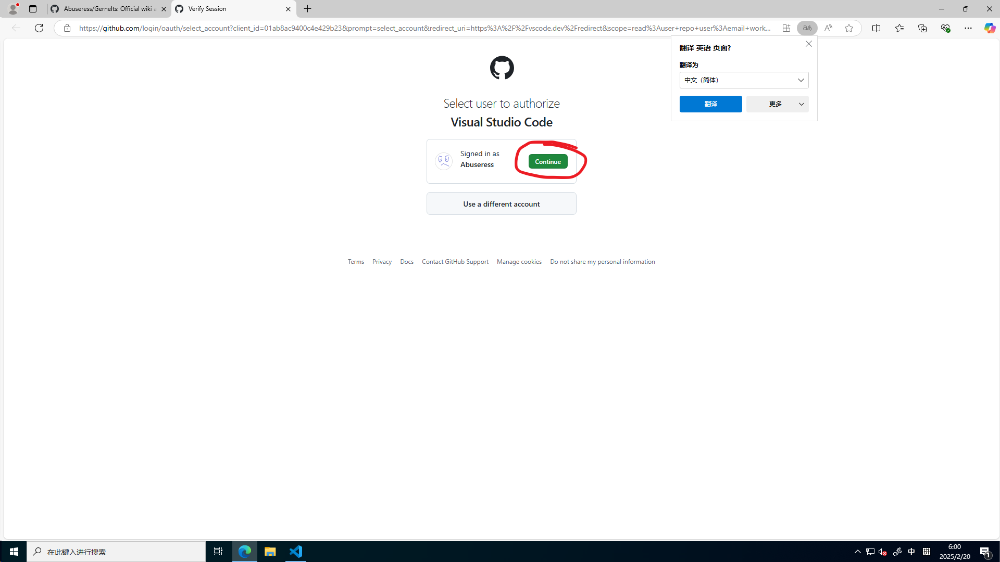
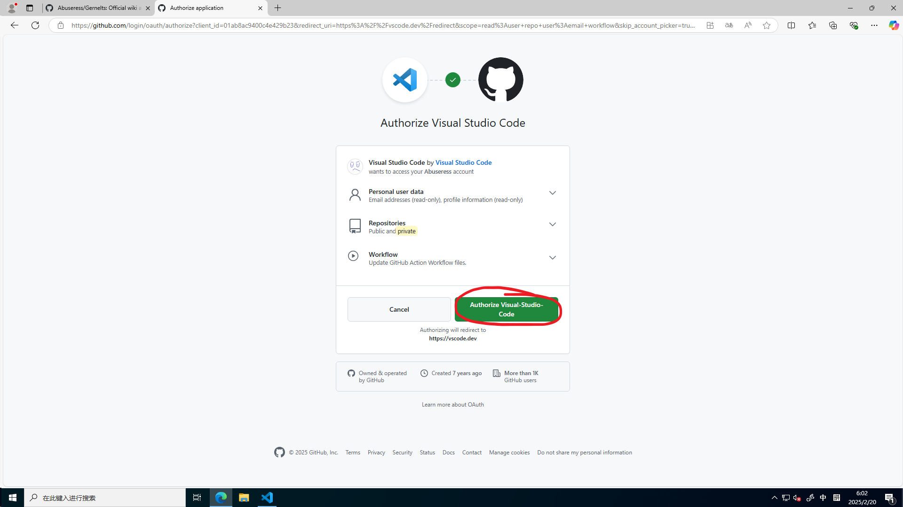
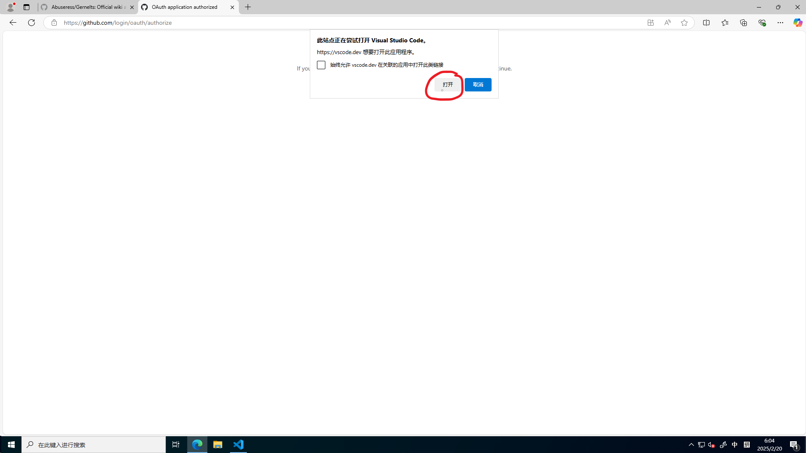

# 什么是PR？如何用VSCode提交PR？
### 什么是PR？
PR，即Pull Request。它允许其他人修改仓库的代码并提交给仓库的所有者\/管理员审核并合并。  
### 一个完整的PR是什么样的？
1. Fork仓库到你的Github账号。
2. Clone仓库到本地。
3. 创建分支。
4. 进行更改。
5. 推送分支。
6. 创建PR。  

听上去有点复杂？别担心！接下来我们将详细带你操作一遍！

### 如何用VSCode提交PR？
打开格内茨宇宙仓库[https://github.com/Gernelts/Gernelts](https://github.com/Gernelts/Gernelts)

如图，点击Fork。  

如图，点击Create fork。

打开VSCode，如图指引下载git。

如图，下载git。  
打开下载后的.exe可执行文件，**除非你知道你在干嘛，否则一路点Next，直到开始读条。**
读条结束，点Finish。  
重启你的VSCode。

如图完成操作。

如图完成操作。

如图，点允许。

如图，会跳出来Github的授权登陆界面，点Continue。

如图，点Authorize Visual-Studio-Code

完事后网页会请求打开VSCode，点“打开”，就会回到VSCode。